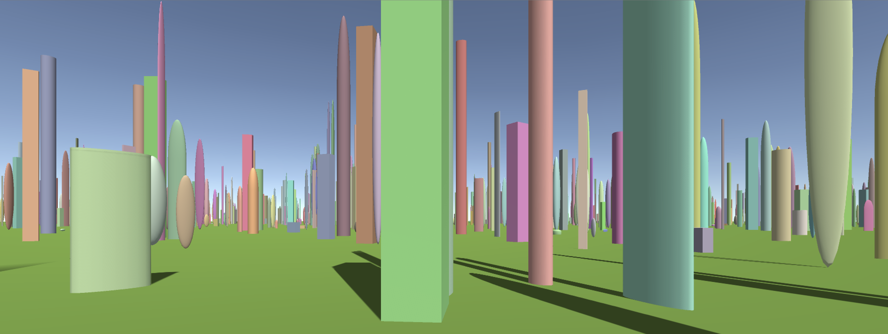

# Cinematic camera procedural movement

The project contains simple project how to procedurally simulate camera movement. Such movement can be useful in cases when it is not known where camera should move and that movement should continue indefinitelly with new positions and viewing angles as camera moves. This can occur in cinematic modes of procedural environment exploration, etc.

The demo scene includes basic exploration of randomly generated city with various primitive shape and color buildings. The camera continues to move procedurally around the city all the time exploring new areas with different viewing angles.

This project was initially created for tutorial https://www.youtube.com/watch?v=XTPupflLDlw and refactored later as well.
